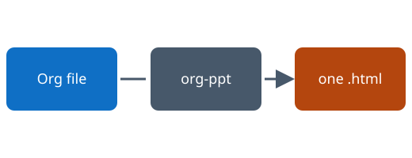
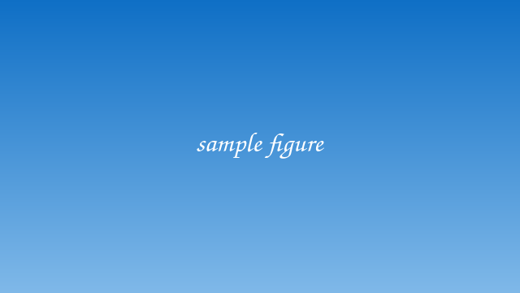

#+TITLE: org-ppt
#+SUBTITLE: Write the talk in Org, present it from one HTML file
#+AUTHOR: Your Name
#+EMAIL: you@example.com
#+DATE: 2026-09-01
#+OPTIONS: toc:t num:nil
#+ORG_PPT_THEME: light
#+ORG_PPT_ACCENT: #0F6FC5
#+ORG_PPT_ASPECT: 16:9
#+ORG_PPT_TRANSITION: fade
#+ORG_PPT_FOOTER: org-ppt demo deck
#+ORG_PPT_SLIDE_LEVEL: 2

* Foundations

** What this is

One Org file in, one =.html= file out. Open it in any browser, press =f=, and
you are presenting. No server, no CDN, no runtime install on the machine that
shows the slides.

#+ATTR_PPT: :fragment t
- Stylesheet and runtime are inlined
- Images are embedded as data URIs
- The deck still works from a USB stick in an offline meeting room

#+BEGIN_NOTES
Speaker notes live here. Press =s= during the talk to open the notes panel
with the timer. The audience never sees this text.
#+END_NOTES

** The pipeline

#+CAPTION: From outline to deck

** Slide anatomy

A headline at the slide level becomes a slide. Anything deeper is content.

*** Deeper headlines become in-slide headings

And the text under them flows normally, with *bold*, /italic/ and =inline code=
all styled for legibility at the back of the room.

** Lists, one step at a time

Put =#+ATTR_PPT: :fragment t= before a list and it builds as you press space.

#+ATTR_PPT: :fragment t
1. First the problem
2. Then the constraint nobody stated
3. Then the design that falls out of it

* Content you actually present

** Code reads at the back of the room

#+BEGIN_SRC vhdl
process (clk) is
begin
  if rising_edge(clk) then
    if rst = '1' then
      count <= (others => '0');
    else
      count <= count + 1;
    end if;
  end if;
end process;
#+END_SRC

** Tables stay readable

| Stage        | Tool      | Output          |
|--------------+-----------+-----------------|
| Authoring    | Emacs Org | =talk.org=      |
| Export       | org-ppt   | =talk.html=     |
| Presentation | Browser   | fullscreen deck |
| Handout      | Ctrl+P    | PDF, 1 page/slide |

** Two columns

#+BEGIN_COLUMNS
#+BEGIN_COLUMN
*Why a single file*

A deck that depends on a folder of assets breaks the moment it is emailed.
Embedding removes that whole failure class.
#+END_COLUMN

#+BEGIN_COLUMN

#+END_COLUMN
#+END_COLUMNS

** Callouts and quotes

#+BEGIN_NOTE
Everything here is plain Org. Nothing in the source is HTML.
#+END_NOTE

#+BEGIN_WARNING
Embedding is on by default. A deck of 40 photographs will be a large file.
#+END_WARNING

#+BEGIN_QUOTE
The framework provides the mechanism, the project provides the facts.
#+END_QUOTE

** A full-bleed figure                                             :figure:

* Presenting

** Driving the deck

- =Space=, =→= advance a step; =←= goes back
- =f= fullscreen, =o= overview, =b= blank the screen
- =s= speaker notes and timer, =d= light/dark
- Type a number and press =Enter= to jump

#+BEGIN_FRAGMENT
=Ctrl+P= prints one page per slide, which is how you get the PDF handout.
#+END_FRAGMENT

*** Reminders                                                       :notes:

A =:notes:= subtree under a slide is speaker-only, exactly like a
=#+BEGIN_NOTES= block. Mention the offline story before the demo.

** Thank you                                                      :section:

Questions?
